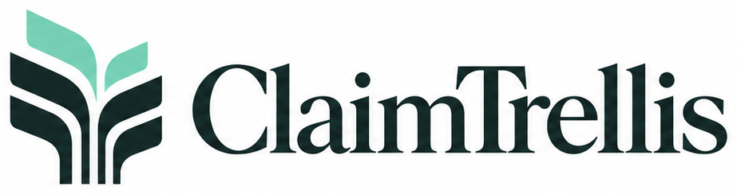

<p align="center">
  
</p>

<p align="center">
  <strong>Every claim, back to the evidence.</strong>
</p>

<p align="center">
  <a href="LICENSE">
    
  </a>
  
  
  
</p>

---

## 🌿 About

**ClaimTrellis** is an open-source system for checking whether an identified source actually supports a written claim.

It combines document parsing, evidence retrieval, deterministic checks, structured semantic judgment, human review, and a traceable audit record.

ClaimTrellis is deliberately narrower than an autonomous fact checker. It asks a specific, inspectable question:

> **Does this source, in this context, support this claim?**

The model proposes. **A person makes the final decision.**

---

## 🔎 What it does

ClaimTrellis can:

- Parse `.txt`, `.md`, `.pdf`, and `.docx` research documents.
- Preserve grounded source locations such as pages, headings, paragraphs, lines, and character offsets where available.
- Retrieve candidate evidence passages from the supplied source.
- Build evidence sets from grounded passages.
- Check quotations, numbers, units, ranges, direction, comparators, and citation signals in code.
- Produce structured judgments about claim–evidence relationships.
- Let reviewers replace evidence, revise judgments, reject proposals, or defer decisions.
- Preserve proposal versions, reviewer actions, policy versions, model provenance, and source hashes.
- Audit individual claims or work through citation-bearing claims across an academic manuscript.

---

## 🧭 How it works

**Claim ➡️ Source ➡️ Parse ➡️ Retrieve evidence ➡️ Deterministic checks ➡️ Structured judgment ➡️ Human review ➡️ Audit trail**

Each layer has a separate responsibility.

**Code** handles what can be checked deterministically.\
**Retrieval** narrows the source to relevant passages.\
**Structured judgment** handles bounded semantic questions.\
**Policy** combines signals conservatively.\
**Humans** retain final authority.

Read the [Trust Specification](docs/TRUST_SPEC.md) for the full boundary between deterministic checks, model judgment, and human review.

---

## 📚 Paper Workflow

ClaimTrellis can review claims across a manuscript rather than requiring every claim to be entered manually.

The workflow supports:

1. Uploading a manuscript.
2. Detecting citation-bearing sentences.
3. Proposing exact-span claim candidates.
4. Human confirmation or editing of atomic claims.
5. Parsing numeric and author-year references.
6. Uploading and identifying cited source documents.
7. Human confirmation of source identity.
8. Running ordinary ClaimAudits for confirmed claim–source pairs.
9. Reviewing results in an Evidence Matrix.

A manuscript never receives a single opaque score.

Every matrix entry remains an individual, traceable **ClaimAudit** with its own evidence, judgment, provenance, and human review.

---

## 🧩 Structured outcomes

ClaimTrellis does not force every source into a binary true/false answer.

A source may:

- `supports`
- `partially_supports`
- `contradicts`
- `not_addressed`
- `insufficient_context`
- `source_unavailable`

The system also evaluates finer dimensions such as population, intervention, comparator, outcome, timeframe, direction, causal fidelity, scope, and evidence sufficiency.

Uncertainty remains visible rather than being converted into false certainty.

---

## 🧪 Evaluation

ClaimTrellis keeps **software correctness**, **retrieval quality**, and **scientific validity** separate.

The repository includes:

- deterministic regression tests,
- public benchmark schemas and fixtures,
- retrieval evaluation tooling,
- calibration and classification metrics,
- literature-derived engineering test cases.

Synthetic tests and integration checks are **not** presented as scientific accuracy validation.

See:

- [Evaluation Protocol](docs/EVALUATION_PROTOCOL.md)
- [Annotation Guide](docs/ANNOTATION_GUIDE.md)
- [Literature Policy](docs/LITERATURE_POLICY.md)
- [Benchmarks](benchmarks/README.md)

---

## 🚀 Quick start

Requires **Python 3.11+**.

ClaimTrellis can be run locally for development and evaluation. See the repository source, configuration, and public documentation for the current setup.

---

## 🧑‍⚖️ Human final judgment

ClaimTrellis never treats model confidence as permission to automatically accept a claim.

Reviewers can:

- accept,
- reject,
- defer,
- request revision,
- replace selected evidence.

Previous proposals remain in the record.

There are no silent overwrites.

---

## 🧾 Auditability

A ClaimAudit records enough provenance to reconstruct how a result was produced, including:

- claim and source identity,
- evidence text and locators,
- document and evidence hashes,
- deterministic findings,
- structured judgment outputs,
- model and question-set versions,
- policy version,
- proposal history,
- reviewer actions,
- revision history.

The goal is not merely to produce an answer.

It is to produce a result that can be **inspected, challenged, and revisited**.

---

## 🛡️ Privacy & security

Research documents may be confidential, unpublished, or copyrighted.

ClaimTrellis separates local processing from provider calls and documents what information is persisted or transmitted.

Before deploying or processing sensitive material, read:

- [Privacy](docs/PRIVACY.md)
- [Threat Model](docs/THREAT_MODEL.md)
- [Security Policy](SECURITY.md)

Authentication, owner isolation, validation, database constraints, and quota enforcement remain security boundaries regardless of whether interactive API documentation is exposed.

---

## 🏗️ Architecture

The project is primarily Python and keeps the verification pipeline modular.

```text
src/claim_trellis/   Core engine, API, storage, retrieval, and provider adapters
web/                 Browser review interface
tests/               Unit, integration, and browser tests
benchmarks/          Public benchmark schemas, fixtures, and evaluation tools
migrations/          PostgreSQL schema migrations
docs/                Stable public architecture, trust, and evaluation documentation
```

For deeper technical details:

- [Architecture](docs/ARCHITECTURE.md)
- [Data Model](docs/DATA_MODEL.md)
- [Trust Specification](docs/TRUST_SPEC.md)
- [Dependency Provenance](docs/DEPENDENCY_PROVENANCE.md)

---

## 🗺️ Roadmap

ClaimTrellis is under active development.

The current direction focuses on strengthening evidence retrieval, paper-scale review workflows, reproducible evaluation, provenance, human review, and scientific-domain verification.

See the public [Roadmap](docs/ROADMAP.md).

---

## 🤝 Contributing

Contributions are welcome.

Please read:

- [Contributing Guide](CONTRIBUTING.md)
- [Code of Conduct](CODE_OF_CONDUCT.md)
- [Developer Certificate of Origin](DCO.md)

Contributors retain copyright in their contributions.

---

## 📄 License

ClaimTrellis is licensed under the [Apache License 2.0](LICENSE).

---

<p align="center">
  <strong>Every claim, back to the evidence.</strong>
</p>
